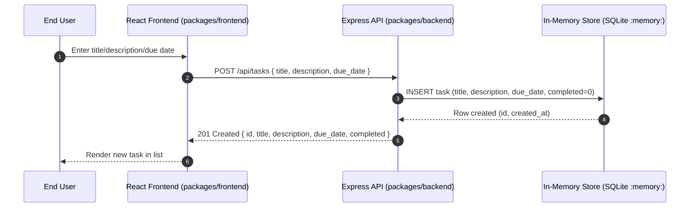

# Cloud Architecture Overview

This repo contains a simple TODO application with a React frontend and an Express API backed by an in-memory store. The diagram below shows the high-level system context.

```mermaid
flowchart LR
  user[End User] -->|Browser (HTTP)| fe[React Frontend\n(packages/frontend)]
  fe -->|HTTP/JSON (fetch)| api[Express API\n(packages/backend)]
  api -->|SQL queries| store[(In-Memory Store\nSQLite :memory:)]
  api -->|JSON responses| fe

  classDef svc fill:#1976d2,stroke:#0d47a1,color:#fff;
  classDef data fill:#ffb74d,stroke:#f57c00,color:#000;
  class fe,api svc;
  class store data;
```

Notes
- React app renders UI, collects input, and calls the API via fetch.
- Express API exposes REST endpoints under /api/tasks.
- Data is stored transiently in an in-memory SQLite database (not persisted).
- Monorepo layout: packages/frontend (React) and packages/backend (Express).

## Sequence: Create a TODO


